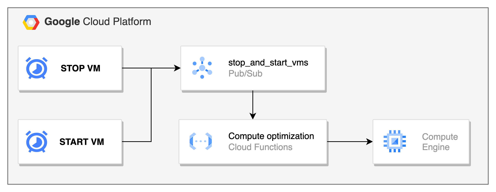

# ComputeOptimization
This repository aims to optimize cloud spending in your `DEV` and `PREPROD` environments. 
Herein you can find a useful automation that will stop and start your virtual machines at a specific hour. To be specific, we are going to stop the VMs during the weekend and at the end of it we will start them again.

With this approach we will decrease the cost consumption of your projects without any disruption.

## Before you begin
The implementation of this automation requires the use of `Cloud Scheduler`, `Pub/sub messages`, `Cloud Functions`, and `Cloud build`.

Moreover, you have to enable the following roles for the Cloud build service account.
- *Cloud Scheduler Admin*
- *Pub/Sub Admin*

## How it works
We configure two different cloud scheduler jobs, the first one runs every Friday and sends a message with the word: `STOP`. The second one runs every Sunday and sends a pub/sub message with the word: `START`. 
Then we have only one topic that receives the Pub/sub messages from both cloud schedulers.
Finally, we have a function that consumes the messages collected in the topic, and depending on the words START or STOP will start or stop the virtual machines.



In the main file of our code, we have hardcoded the virtual machine name, but you can create a separate text file in a storage bucket with the names and zones of all your virtual machines. 
If you prefer, you can use the secret manager and store the list of your virtual machines there. Is up to you.

Finally, we used Cloud build to deploy the solution. The pipeline will create the topic, both Cloud Schedulers jobs, and deploy the function. 

## Manual creation
If you prefer, you can create both cloud schedulers and topic manually by running the commands in this file `build/topic_and_cloud_scheduler.sh`. Then you can deploy the cloud function.

Finally, if you are in a hurry you can start and stop instances using the following `gcloud` commands:

```shell
gcloud compute instances stop VM_NAME
gcloud compute instances start VM_NAME
```

Hope this code helps.